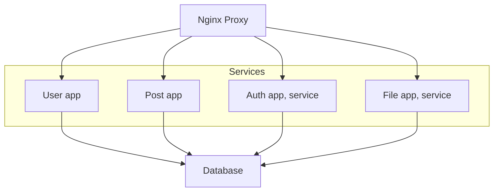

## Monorepo

- Implementation nestjs-monorepo (microservices)
- This repository shows how you can organize the structure in monorepo.
- Feel free to copy, add and use this
- This backend structure is suitable for small applications.

Here Nginx is used as a proxy server. If you have it in production, it is not in docker. You can configure it yourself

## Tools used

-  [Nest JS](https://nestjs.com/)
-  [Prisma](https://www.prisma.io/)
-  [Docker](https://www.docker.com/)

## First start

Before the start you need to install docker and run it.

1.Clone repository

2.Install dependencies

```bash
npm i
```

3.Start dev database

```bash
docker-compose --profile dev up -d 
```

4.Migrate prisma schema

```bash
npm run migrate-dev
```

4.Start all apps

```bash
npm run start:micro
```

## Start prod

Before the start you need to install docker and run it.


```bash
docker-compose --profile prod up -d 
```

## Documentation

After the start applications:

-  [Swagger-Users](http://localhost:3000/users/api-documentation)
-  [Swagger-Auth](http://localhost:3000/auth/api-documentation)
-  [Swagger-Posts](http://localhost:3000/posts/api-documentation)
-  [Swagger-File](http://localhost:3000/file/api-documentation)

## Postman

If you want to test endpoints. You can import this file in Postman

- nestjs-monorepo-nginx.postman_collection.json

## Structure



```
.
├── Dockerfile
├── README.md
├── apps
│   ├── auth
│   │   ├── Dockerfile
│   │   ├── src
│   │   │   ├── auth.controller.ts
│   │   │   ├── auth.module.ts
│   │   │   ├── auth.service.ts
│   │   │   ├── communication.controller.ts
│   │   │   ├── constants
│   │   │   │   └── index.ts
│   │   │   ├── dto
│   │   │   │   ├── login-req.dto.ts
│   │   │   │   ├── login-res.dto.ts
│   │   │   │   └── refresh-token.dto.ts
│   │   │   ├── guards
│   │   │   │   └── jwt-refresh.ts
│   │   │   ├── main.ts
│   │   │   └── services
│   │   │       ├── password.service.ts
│   │   │       └── token.service.ts
│   │   └── tsconfig.app.json
│   ├── file
│   │   ├── Dockerfile
│   │   ├── src
│   │   │   ├── common
│   │   │   │   ├── create-schema.swagger.ts
│   │   │   │   └── stotage.ts
│   │   │   ├── communication.controller.ts
│   │   │   ├── cron.controller.ts
│   │   │   ├── dto
│   │   │   │   └── file.dto.ts
│   │   │   ├── file.controller.ts
│   │   │   ├── file.module.ts
│   │   │   ├── file.service.ts
│   │   │   ├── main.ts
│   │   │   └── services
│   │   │       └── cron.services.ts
│   │   └── tsconfig.app.json
│   ├── post
│   │   ├── Dockerfile
│   │   ├── src
│   │   │   ├── dto
│   │   │   │   ├── create-post.dto.ts
│   │   │   │   ├── post.dto.ts
│   │   │   │   └── update-post.dto.ts
│   │   │   ├── main.ts
│   │   │   ├── post.controller.ts
│   │   │   ├── post.module.ts
│   │   │   └── post.service.ts
│   │   └── tsconfig.app.json
│   └── user
│       ├── Dockerfile
│       ├── src
│       │   ├── constants
│       │   │   └── user-select.ts
│       │   ├── dto
│       │   │   ├── create-user.dto.ts
│       │   │   └── update-user.dto.ts
│       │   ├── main.ts
│       │   ├── user.controller.ts
│       │   ├── user.module.ts
│       │   └── user.service.ts
│       └── tsconfig.app.json
├── docker-compose.yml
├── environment.d.ts
├── libs
│   ├── src
│   │   ├── constants
│   │   │   ├── index.ts
│   │   │   ├── patterns
│   │   │   │   ├── auth.ts
│   │   │   │   └── file.ts
│   │   │   └── services.ts
│   │   ├── decorators
│   │   │   ├── roles.ts
│   │   │   └── token-payload.ts
│   │   ├── dto
│   │   │   ├── auth
│   │   │   │   ├── compare-password.ts
│   │   │   │   ├── token-payload.ts
│   │   │   │   └── tokens.ts
│   │   │   ├── entity.dto.ts
│   │   │   └── user
│   │   │       └── user.dto.ts
│   │   ├── filters
│   │   │   └── exception-up.filter.ts
│   │   ├── guards
│   │   │   ├── jwt-auth.ts
│   │   │   └── role.ts
│   │   ├── models
│   │   │   ├── file
│   │   │   │   └── model.ts
│   │   │   ├── post
│   │   │   │   └── model.ts
│   │   │   └── user
│   │   │       └── model.ts
│   │   ├── modules
│   │   │   └── database
│   │   │       ├── prisma.module.ts
│   │   │       └── prisma.service.ts
│   │   └── services
│   │       └── micro
│   │           └── service.ts
│   └── tsconfig.lib.json
├── migration.sh
├── nest-cli.json
├── nginx
│   ├── Dockerfile
│   └── nginx.template.conf
├── package-lock.json
├── package.json
├── prisma
│   └── schema.prisma
├── tsconfig.build.json
└── tsconfig.json

```

## Node version

- node - 20.16.0
- npm - 10.8.1

